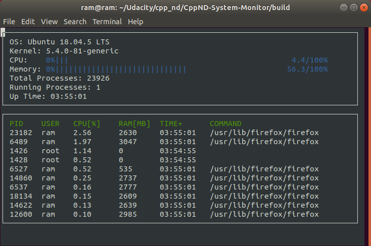

# CppND-System-Monitor

## Dependencies

[ncurses](https://www.gnu.org/software/ncurses/) is a library that facilitates text-based graphical output in the terminal. This project relies on ncurses for display output.

If you are not using the Workspace, install ncurses within your own Linux environment: `sudo apt install libncurses5-dev libncursesw5-dev`

## Make
This project uses [Make](https://www.gnu.org/software/make/). The Makefile has four targets:
* `build` compiles the source code and generates an executable
* `format` applies [ClangFormat](https://clang.llvm.org/docs/ClangFormat.html) to style the source code
* `debug` compiles the source code and generates an executable, including debugging symbols
* `clean` deletes the `build/` directory, including all of the build artifacts

## Build Instructions

1. `cd ~/`
2. Clone the project repository: `git clone https://github.com/ramchendooran/system_monitor_cppnd.git`
3. `cd ~system_monitor_cppnd`
4. `mkdir build` 
5. Build the project: `make build`
6. Run the resulting executable: `./build/monitor`
  

